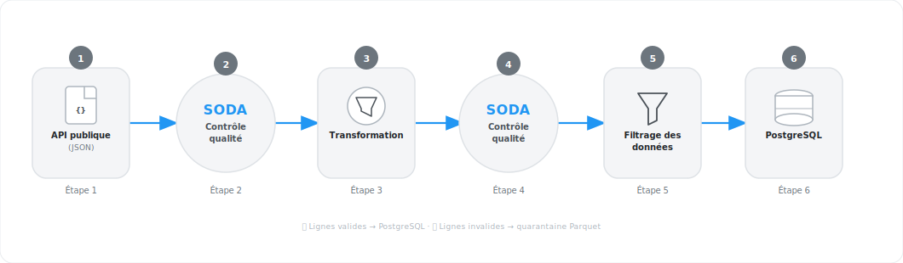
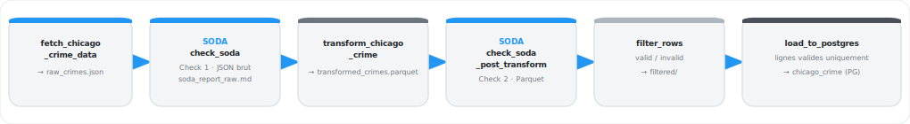

<p align="center">
  
</p>

<p align="center">
  <strong>Formation Data Engineer · P1 2025-2027</strong><br/>
  Groupe · DonkeyVampires<br/>
  Kaouter &nbsp;|&nbsp; Zoubir &nbsp;|&nbsp; Khalid<br/>
  <em>11 mars 2026</em>
</p>

---

# Chicago Crime Pipeline

## Objectif du projet

Ce projet a pour objectif de construire un **pipeline de données de bout en bout** sur les données de criminalité de la ville de Chicago. Il couvre l'ensemble du cycle de vie de la donnée :

1. **Ingestion** — récupération automatique des données depuis l'API publique Chicago Data Portal (format JSON)
2. **Contrôle qualité initial** — vérification du JSON brut via des contrats Soda (complétude, plages de valeurs, types)
3. **Transformation** — nettoyage, typage, déduplication et conversion en Parquet
4. **Contrôle qualité post-transformation** — second passage Soda sur les données typées pour valider la conformité métier
5. **Filtrage** — séparation ligne par ligne des données valides (→ PostgreSQL) et invalides (→ quarantaine Parquet)
6. **Chargement** — insertion des lignes conformes dans une base PostgreSQL hébergée sur Render

Le pipeline est orchestré par **Apache Airflow** (Astro CLI) et s'exécute quotidiennement, garantissant une mise à jour régulière des données en base.

---

Pipeline de données automatisé pour ingérer, vérifier, transformer et charger les données de criminalité de Chicago vers PostgreSQL.

## Stack technique

| Outil | Rôle |
|---|---|
| Apache Airflow (Astro CLI) | Orchestration du pipeline |
| Soda Core 4.x + DuckDB | Contrôle qualité des données |
| Pandas + PyArrow | Transformation et Parquet I/O |
| SQLAlchemy + psycopg2 | Chargement PostgreSQL |
| Render | Hébergement PostgreSQL |
| Docker | Environnement d'exécution |

## Architecture du pipeline

<p align="center">
  
</p>

## Structure du projet

```
├── dags/
│   └── pipeline_chicago_crime.py       # DAG principal (6 tâches)
├── src/
│   ├── ingestion.py                    # Appel API Chicago Data Portal
│   ├── soda_check.py                   # Vérification qualité Soda V4
│   ├── transformation.py               # Nettoyage et typage des données
│   ├── filtering.py                    # Filtrage valid / invalid
│   └── load.py                         # Chargement PostgreSQL
├── include/
│   ├── soda_scan/
│   │   ├── soda_rules_firstcheck.yml   # Contrat qualité (données brutes)
│   │   └── soda_rules_secondcheck.yml  # Contrat qualité (post-transform)
│   ├── create_tables.sql               # Schéma PostgreSQL
│   ├── reports/
│   │   ├── soda_report_raw.md          # Rapport check 1
│   │   └── soda_report_transformed.md  # Rapport check 2
│   └── data/
│       ├── raw/                        # raw_crimes.json
│       ├── transformed/                # transformed_crimes.parquet
│       └── filtered/                   # valid_crimes.parquet + invalid_crimes.parquet
├── .env                                # Variables d'environnement (non versionné)
├── .env.example                        # Template .env
├── requirements.txt
├── Dockerfile
└── airflow_settings.yaml               # Connexion Airflow locale
```

## Fonctionnement du DAG

Le DAG `pipeline_chicago_crime` s'exécute quotidiennement (`schedule='@daily'`) et enchaîne 6 tâches séquentielles. Chaque tâche transmet le chemin du fichier produit à la suivante via XCom.

<p align="center">
  
</p>

Si un check Soda échoue, le contrat qualité est rompu mais le pipeline continue (comportement configurable).


## Contrôles qualité (Soda)

Deux contrats YAML sont exécutés via **Soda V4 + DuckDB** à des étapes différentes du pipeline. Chaque contrat génère un rapport Markdown dans `include/reports/`.

---

### Check 1 — Données brutes (`soda_rules_firstcheck.yml`)

Exécuté sur le **JSON brut** issu de l'API, avant toute transformation.

| Catégorie | Colonne(s) | Contrôles réalisés |
|---|---|---|
| Identifiant | `id` | Non nul, sans doublon, valeur ≥ 1 |
| Identifiant | `case_number` | Non nul |
| Dates | `date`, `updated_on` | Non nul |
| Dates | `year` | Non nul, entre 2001 et 2026 |
| Localisation | `block` | Non nul |
| Codes administratifs | `beat` | Non nul, entre 100 et 2535 |
| Codes administratifs | `district` | Non nul, entre 1 et 25 (districts Chicago PD) |
| Codes administratifs | `ward` | Non nul, entre 1 et 50 (wards de Chicago) |
| Codes administratifs | `community_area` | Non nul, entre 1 et 77 (community areas) |
| Classification | `iucr`, `primary_type`, `description`, `fbi_code` | Non nul |
| Booléens | `arrest`, `domestic` | Non nul |
| Coordonnées projetées | `x_coordinate` | Entre 1 050 000 et 1 210 000 (bornes Chicago) |
| Coordonnées projetées | `y_coordinate` | Entre 1 810 000 et 1 955 000 (bornes Chicago) |
| Coordonnées GPS | `latitude` | Entre 41.60 et 42.05 |
| Coordonnées GPS | `longitude` | Entre -87.95 et -87.50 |

---

### Check 2 — Données transformées (`soda_rules_secondcheck.yml`)

Exécuté sur le **Parquet nettoyé**, après transformation. Les règles sont plus strictes car les données ont été typées et dédupliquées.

| Catégorie | Colonne(s) | Contrôles réalisés |
|---|---|---|
| Identifiant | `id` | Non nul, **sans doublon** (déduplication vérifiée) |
| Identifiant | `case_number` | Non nul |
| Dates | `date` | Non nul, type `timestamp`, entre 2001-01-01 et 2026-12-31 |
| Dates | `year` | Non nul, entre 2001 et 2026 |
| Dates | `updated_on` | Non nul, type `timestamp` |
| Classification | `primary_type` | Non nul, valeur dans les **31 types officiels Chicago PD** |
| Classification | `iucr`, `fbi_code` | Non nul |
| Coordonnées GPS | `latitude` | Entre 41.60 et 42.05 |
| Coordonnées GPS | `longitude` | Entre -87.95 et -87.50 |
| Coordonnées projetées | `x_coordinate` | Entre 1 050 000 et 1 210 000 |
| Coordonnées projetées | `y_coordinate` | Entre 1 810 000 et 1 955 000 |

---

### Filtrage post-check 2

Après le second check, `filtering.py` applique les mêmes règles de manière **ligne par ligne** et produit :

- ✅ `valid_*.parquet` — lignes conformes, chargées dans PostgreSQL
- ❌ `invalid_*.parquet` — lignes rejetées, conservées en **quarantaine Parquet** (non chargées en base)


## Scripts source (`src/`)

### `ingestion.py`
Interroge l'API publique [Chicago Data Portal](https://data.cityofchicago.org) (endpoint Socrata), récupère les données de criminalité en JSON, et les sauvegarde dans `include/data/raw/raw_crimes.json` (écrase le fichier à chaque run).

### `soda_check.py`
Encapsule les vérifications qualité **Soda V4** via DuckDB (moteur in-memory).

- `check_soda(file_path, contract_file_path)` — charge le fichier (JSON ou Parquet détecté automatiquement) dans une table DuckDB `chicago_crime`, exécute le contrat YAML, écrit un rapport dans `include/reports/`, retourne le résultat.
- `run_check_soda(**context)` — wrapper Airflow pour le **check 1**, génère `include/reports/soda_report_raw.md`.
- `run_check_soda_post_transform(**context)` — wrapper Airflow pour le **check 2**, génère `include/reports/soda_report_transformed.md`.

### `transformation.py`
Charge le JSON brut, applique le pipeline de nettoyage suivant, et sauvegarde le résultat en Parquet dans `include/data/transformed/` :

1. Suppression des colonnes calculées (`:@computed_region_*`)
2. Remplissage des coordonnées manquantes depuis le champ `location`
3. Sélection des colonnes utiles uniquement
4. Parsing des dates (`date`, `updated_on`)
5. Typage des colonnes (`id` → int, `year`/`district` → int, `latitude`/`longitude` → float, booléens)
6. Déduplication sur `id`

### `filtering.py`
Applique des règles de validation ligne par ligne sur le Parquet transformé et produit deux fichiers :

- `include/data/filtered/valid_crimes.parquet` — lignes conformes, prêtes pour PostgreSQL
- `include/data/filtered/invalid_crimes.parquet` — lignes rejetées (quarantaine)

Règles appliquées : `id` non nul, `date` et `year` entre 2001 et 2026, `primary_type` dans la liste officielle Chicago PD, `district` entre 1 et 25, coordonnées dans les bornes géographiques de Chicago.

### `load.py`
Charge les lignes valides dans PostgreSQL via SQLAlchemy.

- `get_engine()` — crée le moteur à partir des variables d'environnement.
- `execute_sql_file(engine, path)` — exécute `include/create_tables.sql` (idempotent, `IF NOT EXISTS`).
- `load_parquet(engine, path, table_name)` — lit le Parquet et insère via `df.to_sql()`.
- `run_load(**context)` — wrapper Airflow : crée la table si besoin, charge `valid_*.parquet` dans `chicago_crime`, logue le chemin de quarantaine sans le charger.

## Tests

Les tests unitaires sont situés dans `tests/dags/test_dag_example.py`. Ils vérifient la structure et la configuration du DAG **sans déclencher d'exécution réelle** — aucune connexion à la base de données ni appel API n'est effectué.

### Ce qui est testé

| Test | Description |
|---|---|
| `test_dag_loaded` | Le DAG est importé sans erreur |
| `test_dag_has_correct_number_of_tasks` | Le DAG contient exactement 6 tâches |
| `test_dag_task_ids` | Les identifiants de tâches correspondent aux noms attendus |
| `test_dag_schedule` | Le DAG est planifié en `@daily` |
| `test_dag_catchup_disabled` | Le `catchup` est désactivé |
| `test_dag_owner` | Le propriétaire du DAG est `DonkeyVampires` |
| `test_dag_retries` | Chaque tâche a 2 retries configurés |
| `test_dag_dependency_chain` | Les 6 tâches s'enchaînent dans le bon ordre |
| `test_first_task_has_no_upstream` | `fetch_chicago_crime_data` n'a pas de dépendance amont |
| `test_last_task_has_no_downstream` | `load_to_postgres` n'a pas de dépendance aval |

### Pourquoi dans le container ?

Les tests utilisent `airflow.models.DagBag` pour charger le DAG. Ce module nécessite un environnement Airflow complet (base de données, configuration, dépendances). Il faut donc exécuter les tests **à l'intérieur du container scheduler**, qui dispose de tout cet environnement.

### Lancer les tests

S'assurer que les containers sont démarrés :

```bash
astro dev start
```

Puis exécuter les tests dans le container scheduler :

```bash
docker exec astro-project_fda9ec-scheduler-1 python -m pytest tests/dags/test_dag_example.py -v
```

Résultat attendu :

```
collected 10 items

test_dag_loaded PASSED
test_dag_has_correct_number_of_tasks PASSED
test_dag_task_ids PASSED
test_dag_schedule PASSED
test_dag_catchup_disabled PASSED
test_dag_owner PASSED
test_dag_retries PASSED
test_dag_dependency_chain PASSED
test_first_task_has_no_upstream PASSED
test_last_task_has_no_downstream PASSED

======================== 10 passed in 4.57s ========================
```

> **Note** : Le nom du container (`astro-project_fda9ec-scheduler-1`) peut varier selon la machine. Le vérifier avec `astro dev ps`.

## Prérequis

- [Docker](https://docs.docker.com/get-docker/) + [Astro CLI](https://www.astronomer.io/docs/astro/cli/install-cli)
- Compte [Render](https://render.com) avec une base PostgreSQL

## Démarrage rapide

```bash
# 1. Cloner le repo
git clone https://github.com/Simplon-DE-P1-2025/DonkeyVampires-AirflowSoda-ChicagoCrimePipeline.git
cd DonkeyVampires-AirflowSoda-ChicagoCrimePipeline

# 2. Créer le fichier .env
cp .env.example .env   # puis renseigner les credentials PostgreSQL

# 3. Démarrer Airflow
astro dev start

# 4. Ouvrir l'interface Airflow
# http://localhost:8080  (admin / admin)
```

## Variables d'environnement

Créer un fichier `.env` dans `astro_project/` :

```env
POSTGRES_HOST=HOST
POSTGRES_PORT=PORT
POSTGRES_DB=DB_NAME
POSTGRES_USER=USER_NAME
POSTGRES_PASSWORD=PASSWORD

# UID Linux de l'hôte (évite les problèmes de permissions sur include/)
AIRFLOW_UID=1000
```

> ⚠️ Utiliser le **hostname externe** Render (visible dans Dashboard → PostgreSQL → External Database URL). Le hostname interne n'est pas résolvable depuis Docker.

> Vérifier son UID Linux avec `id -u` et mettre à jour `AIRFLOW_UID` en conséquence.


## Connexion Airflow

La connexion `postgres_chicago_crime` est déclarée dans `airflow_settings.yaml` et en `.env` chargée automatiquement au démarrage local.